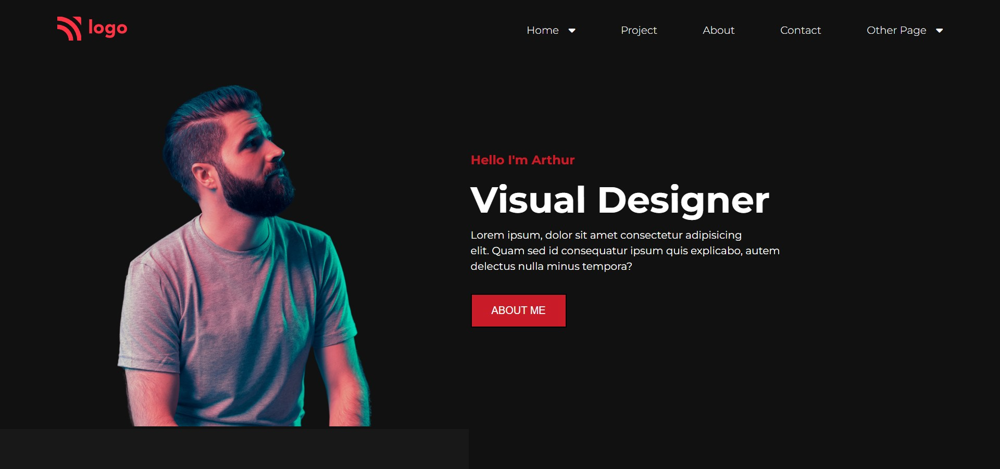

# Live Project 15 : Product Design Landing Page

## Project 15: [Live Link](https://live-project-15-fs-js.netlify.app/)

-   Skills Gained in this project.
    - Learned to create background box for visual design.
    - Uses flex-wrap which helps in making useful responsive elements.
    - Gained indepth knowledge of flexbox.
        
---

## Time taken to finish this project⏲

- >Around 4.5 hours.

#### Screenshot

